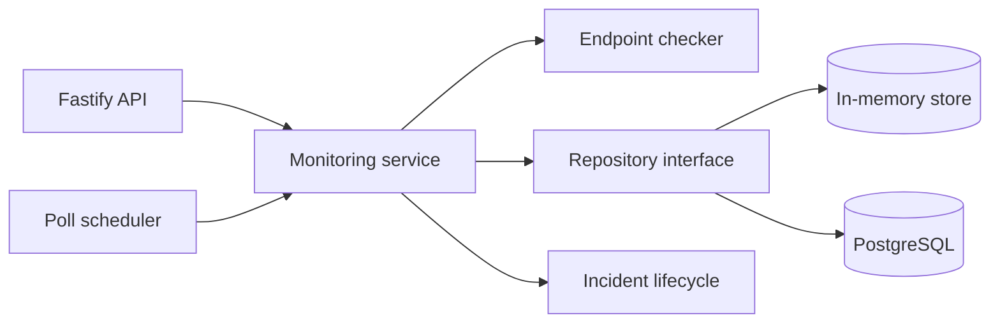

# SignalWatch architecture

## Components

**Fastify API** validates external requests and exposes monitor/history/incident operations.

**Poll scheduler** determines which monitors are due and executes checks concurrently.

**Endpoint checker** owns timeout, latency, and HTTP-health classification.

**Monitoring service** coordinates persistence and incident-state behavior.

**Repository interface** keeps domain logic independent from PostgreSQL and allows deterministic in-memory tests.

## Incident rule

A single failure is recorded but does not open an incident. Two consecutive failures open one incident. A later successful check resolves the currently open incident.

## Why the repository abstraction matters

The service tests run without a network database, while the production implementation can persist monitors, checks, and incidents in PostgreSQL.
